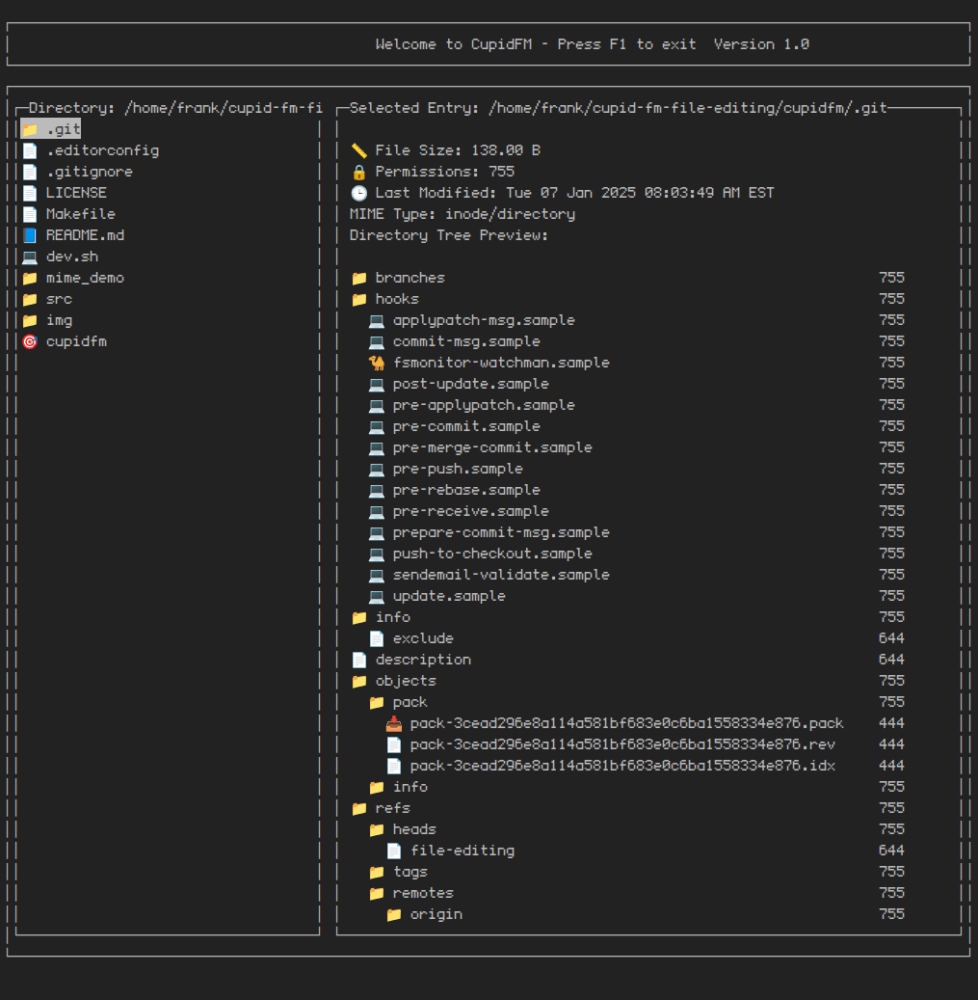

# cupidfm - file editing

cupidfm is a terminal-based file manager implemented in C. It uses the `ncurses` library for the user interface, providing features like directory navigation, directory tree preview, file preview, file editing, and file information display. 



### Terminal Requirements

For proper emoji display:
- Make sure your terminal emulator supports Unicode and emoji rendering
For proper emoji and icon display:

1. Install a Nerd Font (recommended):
```bash
# On Ubuntu/Debian:
mkdir -p ~/.local/share/fonts
cd ~/.local/share/fonts
curl -fLO https://github.com/ryanoasis/nerd-fonts/releases/download/v3.1.1/JetBrainsMono.zip
unzip JetBrainsMono.zip
fc-cache -fv
```

2. Configure your terminal:
- Set your terminal font to "JetBrainsMono Nerd Font" (or another Nerd Font)
- Ensure your terminal emulator supports Unicode and emoji rendering
- Set your locale to support UTF-8: `export LANG=en_US.UTF-8`

Alternative fonts:
- Noto Color Emoji (`sudo apt install fonts-noto-color-emoji`)
- Fira Code Nerd Font
- Hack Nerd Font

If emojis aren't displaying correctly:
1. Check your terminal supports Unicode: `echo -e "\xf0\x9f\x93\x81"`
2. Verify locale settings: `locale`
3. Try updating your terminal emulator to a newer version

Note: Some terminal emulators like Alacritty, iTerm2, Konsole, and Kitty are known to work better with unicode/emojis. 

# Features

- Navigate directories using arrow keys
- View file details and preview supported file types
- Display MIME types based on file content using `libmagic`
- File type indicators with emoji icons:
  - 📄 Text files
  - 📝 C source files
  - 🔣 JSON files
  - 📑 XML files
  - 🐍 Python files
  - 🌐 HTML files
  - 🎨 CSS files
  - ☕ Java files
  - 💻 Shell scripts
  - 🦀 Rust files
  - 📘 Markdown files
  - 📊 CSV files
  - 🐪 Perl files
  - 💎 Ruby files
  - 🐘 PHP files
  - 🐹 Go files
  - 🦅 Swift files
  - 🎯 Kotlin files
  - ⚡ Scala files
  - 🌙 Lua files
  - 📦 Archive files
- Text editing capabilities within the terminal
- Directory tree visualization with permissions
- File information display (size, permissions, modification time)
- Scrollable preview window
- Tab-based window switching between directory and preview panes

## Todo

### High Priority
- [ ] Fix directory preview not scrolling 
- [ ] Write custom magic library for in-house MIME type detection
- [ ] Implement proper memory management and cleanup for file attributes and vectors
- [ ] Add error handling for failed memory allocations
- [ ] Optimize file loading performance for large directories

### Edit Mode Issues
- [ ] Banner marquee not rotating correctly when rotating in edit mode
- [ ] Fix sig winch handling breaking while in edit mode
- [ ] Fix cursor showing up at the bottom of the text editing buffer
- [ ] Fix text buffer not scrolling to the right when typing and hitting the border of the window

### Features
- [ ] Enable scrolling for tree preview in the preview window when tabbed over
- [ ] Add preview support for `.zip` and `.tar` files
- [ ] Implement syntax highlighting for supported file types
- [ ] Display symbolic links with correct arrow notation (e.g., `->` showing the target path)
- [ ] Implement text editing shortcuts:
  - [ ] Shift+arrow for selection
  - [ ] Ctrl+arrow for faster cursor movement
  - [ ] Standard shortcuts (Ctrl+X, Ctrl+C, Ctrl+V)
  - [ ] Add undo/redo functionality in edit mode
  - [ ] Implement proper text selection in edit mode
- [ ] Add file operations:
  - [ ] Copy/paste files and directories
  - [ ] Create new file/directory
  - [ ] Delete file/directory
  - [ ] Rename file/directory
- [ ] Add a quick select feature for selecting file names, dir names, and current directory
- [ ] Implement file search functionality
- [ ] Add file filtering options
- [ ] Implement file/directory permissions editing
- [ ] Add configuration file support for customizing:
  - [ ] Key bindings
  - [ ] Color schemes
  - [ ] Default text editor
  - [ ] File associations
  - [ ] Change default text preview files
- [ ] Add image preview
- [ ] Basic file dialog for web and other applications
- [ ] Basic install script for building, installing nerd fonts and other dependencies, and then moving the executable to /usr/bin 

### Key Features to Implement

## Command Line Interface (CLI) Feature

### Overview

The **Command Line Interface (CLI)** for **cupidfm** will introduce a powerful way for users to perform common file operations directly from the application, similar to a terminal within the file manager. This feature will enable users to execute commands like navigating directories, opening files, copying/moving files, and even running system commands without leaving the **cupidfm** interface.

### Planned Features for the CLI

- **Command Input**: 
  - Users will have access to a bottom command bar where commands can be typed.
  - Basic commands like `cd`, `ls`, `open`, `copy`, `move`, `delete` will be supported.

- **Command History**:
  - Pressing the **Up/Down arrow keys** will cycle through previously executed commands, similar to a traditional terminal.

- **Tab Completion**:
  - Auto-complete file and directory names by pressing **TAB** while typing a command.

- **Error Handling**:
  - Clear and descriptive error messages will be displayed in the command bar when commands fail (e.g., "File not found" or "Permission denied").

- **Custom cupidfm Commands**:
  - Extend the functionality of traditional file operations with cupidfm-specific commands, such as:
    - `tree`: Display the directory tree structure.
    - `preview [file]`: Quickly open a file in the preview window.
    - `info [file/dir]`: Show detailed information about a file or directory.

- **System Command Integration**:
  - Run standard shell commands like `grep`, `find`, `chmod`, and others directly from the cupidfm command bar.

---

### Usage Examples

#### 1. **Navigating Directories**
```bash
> cd ~/Documents
```
- Changes the current working directory to `~/Documents`.

#### 2. **Listing Files**
```bash
> ls
```
- Lists all files and directories in the current working directory.

#### 3. **Opening a File**
```bash
> open notes.txt
```
- Opens `notes.txt` in the **preview window** or the **edit mode**.

#### 4. **Copying Files**
```bash
> copy file1.txt ~/Documents/backup/
```
- Copies `file1.txt` to the `~/Documents/backup/` directory.

#### 5. **Moving Files**
```bash
> move file1.txt ~/Downloads/
```
- Moves `file1.txt` to the `~/Downloads/` directory.

#### 6. **Deleting a File**
```bash
> delete file1.txt
```
- Deletes `file1.txt` with a confirmation prompt.

#### 7. **Directory Tree View**
```bash
> tree
```
- Displays the directory structure of the current folder in the **preview window**.

#### 8. **Searching for Files**
```bash
> find "*.c"
```
- Finds all `.c` files in the current directory and its subdirectories.

#### 9. **Checking File Information**
```bash
> info file1.txt
```
- Displays details like size, permissions, and modification time for `file1.txt`.

---

### Future Plans for File Operations Shortcuts 
- [ ] **Notification on shortcut**
  - Convert the notfication bar to work with the command line
  - Ex. When a user enters command mode it will show up where the notifications does.

- [ ] **Copy and Paste (Ctrl+C, Ctrl+V)**  
  - Copy selected file or directory.
  - Paste copied item into the current directory.

- [ ] **Cut and Paste (Ctrl+X, Ctrl+V)**  
  - Move selected file or directory.
  - Paste cut item into the current directory.

- [ ] **Delete (Ctrl+D)**  
  - Delete selected file or directory with a confirmation prompt.

- [ ] **Rename (Ctrl+R)**  
  - Rename the selected file or directory.

- [ ] **Create New File (Ctrl+N)**  
  - Create a new, empty file in the current directory.

- [ ] **Create New Directory (Ctrl+Shift+N)**  
  - Create a new directory in the current directory.

- [ ] **Select All (Ctrl+A)**  
  - Select all files and directories in the current view.

- [ ] **File Search (Ctrl+F)**  
  - Search for files or directories by name or pattern.

- [ ] **Quick File Info (Ctrl+I)**  
  - Display detailed information about the selected file or directory.

- [ ] **Undo/Redo (Ctrl+Z / Ctrl+Y)**  
  - Undo or redo the last file operation.

- [ ] **File Permissions (Ctrl+P)**  
  - Edit permissions of the selected file or directory.

- [ ] **Quick Move (F2)**  
  - Open a prompt to quickly move the selected file or directory to a specified path.

- [ ] **Batch Operations (Ctrl+Shift+B)**  
  - Perform batch operations like copying, moving, or deleting multiple selected files.

- [ ] **Symbolic Link Creation (Ctrl+L)**  
  - Create a symbolic link for the selected file or directory.

- [ ] **File Filtering (Ctrl+Shift+F)**  
  - Apply filters to display files by type, size, or modification date.

#### **1. Command Bar Design**
- [ ] Add a command bar at the bottom of the **cupidfm** interface.
- [ ] Display typed commands dynamically and update the UI to show results or error messages.

#### **2. Command Execution**
- [ ] Parse and interpret user input.
- [ ] Support basic file operations (`open`, `cd`, `ls`, `copy`, `move`, `delete`, etc.).
- [ ] Integrate with system utilities for advanced commands.

#### **3. Real-Time Feedback**
- [ ] Display real-time feedback or results in the command bar.
- [ ] Handle errors gracefully and inform users of invalid commands or paths.

#### **4. Custom Commands**
- [ ] Introduce cupidfm-specific commands for enhanced functionality, like:
  - `tree`
  - `preview`
  - `info`

#### **5. System Command Integration**
- [ ] Allow users to run basic shell commands without leaving the application.
- [ ] Commands like `grep` and `chmod` should work seamlessly.

#### **6. Configurable Aliases**
- [ ] Allow users to create command aliases for frequently used commands (e.g., alias `ls` to `list`).

---

### Todo List for Command Line Feature

- [ ] Design and implement the command bar UI.
- [ ] Add a command parser to interpret user input.
- [ ] Implement core file operations (`cd`, `ls`, `open`, etc.).
- [ ] Add error handling and feedback messages.
- [ ] Support command history with Up/Down arrow keys.
- [ ] Implement tab-based auto-completion for file and directory names.
- [ ] Develop custom cupidfm commands (`tree`, `info`, etc.).
- [ ] Integrate with system shell commands.
- [ ] Allow user-defined aliases in a configuration file.

### Performance Improvements
- [ ] Implement lazy loading for large directories
- [ ] Optimize memory usage for file preview
- [ ] Cache directory contents for faster navigation
- [ ] Improve MIME type detection performance
- [ ] Implement background loading for directory contents

### Completed
- [X] Fallback to extension-based detection instead of MIME type when detection fails
- [X] Fix directory list not staying within the border
- [X] Implement directory tree preview for directories
- [X] Fix weird crash on different window resize
- [X] Fix text buffer from breaking the preview win border
- [X] Fix issue with title banner notif rotating showing char when rotating from left side to right
- [X] Fix inputs being overloaded and taking awhile to execute
- [X] Add build version and name display
- [X] Add cursor highlighting to text editing buffer
- [X] Add line numbers to text editing buffer
- [X] Fix preview window not updating on directory enter and leave
- [X] Implement proper file item list
- [X] Fix directory list being too big and getting cut off
- [X] Fix crashing when trying to edit too small of a file
- [X] Add support for sig winch handling
- [X] Fix being able to enter directory before calculation is done
- [X] Add directory window scrolling
- [X] Add tree structure visualization with proper icons and indentation
- [X] File info not using emojis
- [X] Add text display on tree preview when user enters an empty dir and on dir preview

## Prerequisites

To build and run CupidFM, you need the following dependencies installed:

- `gcc` (GNU Compiler Collection)
- `make` (build automation tool)
- `ncurses` library for terminal handling
- `libmagic` for MIME type detection based on file content

### Installing Dependencies on Ubuntu

Run the following command to install the necessary packages:

```bash
sudo apt update
sudo apt install build-essential libncurses-dev libmagic-dev
```

## Building the Project

To compile the project, run:

```bash
./dev.sh
```

This script will use `make` with predefined flags to compile the source code and produce an executable named `cupidfm`.

### Compilation Flags

The script uses several compilation flags:

- `-Wall -Wextra -pedantic`: Enable warnings
- `-Wshadow -Werror -Wstrict-overflow`: Additional strictness for code
- `-fsanitize=address -fsanitize=undefined`: Enable sanitization for debugging

## Running the Program

After compilation, you can run the program:

```bash
./cupidfm
```

This will start cupidfm. Error logs will be saved in `log.txt`.

## File Structure

- `src/`: Contains the source code files
- `dev.sh`: Script for compiling the project
- `Makefile`: Used by `make` for the build process
- `LICENSE`, `README.md`: Documentation and license information

## Usage

- **Navigation**:
  - **Up/Down**: Move between files
  - **Left/Right**: Navigate to parent/child directories
  - **F1**: Exit the application
  - **TAB**: Switch between directory and preview windows
  - **CONTROL+E**: Edit file in preview window
  - **CONTROL+G**: Save file while editing

## Contributing

Contributions are welcome! Please submit a pull request or open an issue for any changes.

## License

This project is licensed under the GNU General Public License v3.0 terms.
